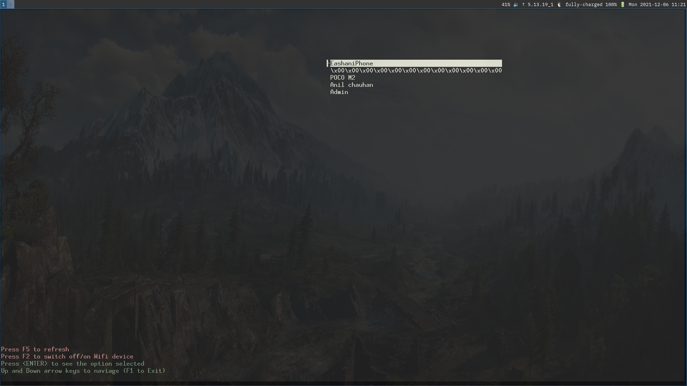

# Witui
A simple tui to set your wifi. Minimal enough to be used in a embedded UNIX installation! 
# Why any other wpa client sucks (for e.g. `wpa_tui`)?
* Slow AF (takes a few seconds to do anything in them).
* Open source ones use an init systemd as backend! 
* One needs to install `wpa_gui` to get offical `wpa_tui`, and is not availble for wayland repos
* No root access needed anymore!

# Usage
Download (or build) the app
```
witui
````

# Build Instructions

```
make
```
For cleaning
```
make clean
```

# Screenshots



# Supports 
 PSK encrypted wifi signals (for home networks) or any public one with no key management( for e.g. coffee shops/airpots). 

 You can review the changes made by this tool by going through the `/etc/wpa_supplicant/wpa_supplicant.conf` file itself
